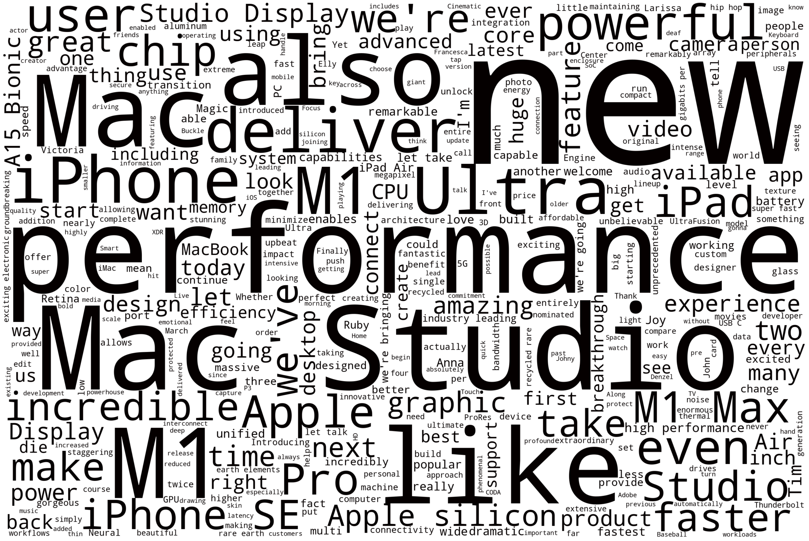

# NLP-Apple-Event-March-8-2022
 NLP for Watch the special Apple Event to learn about the all-new Mac Studio and Studio Display, new iPad Air, new iPhone SE, and iPhone 13 Pro and iPhone 13 in two new shades of green.
 
<a href="https://youtu.be/CUwg_JoNHpo">Watch the event in here!</a>

## Findings
- The average length of sentence in apple event is 8.02235294117647
- After applying stop words to subtitles, length of subtext_list from 5094 drop to 3111
- The top 5 most frequent words in this Apple event
  - ('M1', 58), ('Mac', 54), ('Studio', 41), ('new', 39), ('iPhone', 30)
- The top 5 most frequent pair of words in this event
  - ('Mac', 'Studio'), ('M1', 'Ultra'), ('we', "'re"), ('It', "'s"), ('M1', 'Max')

## Graphs

### black and white word cloud

### The most frequent words in this Apple event

### The most frequent pair of words in this event

